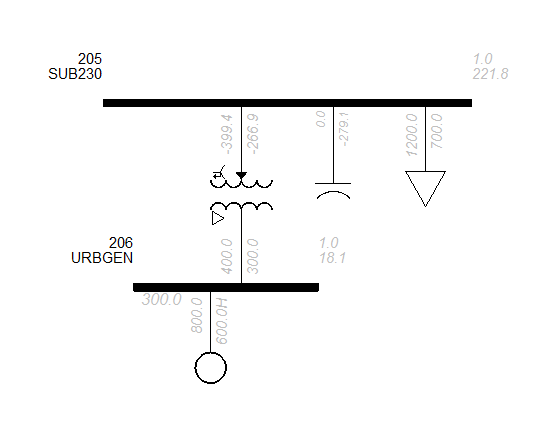
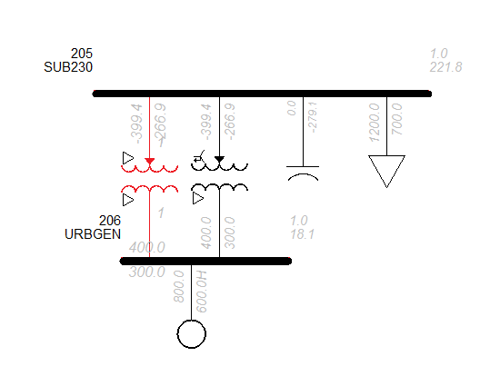

#Project 2001 
##Energization 2
In this structure, A set of energization data is stored in an Energization "Branch" - *EN* branch.
The naming convention of the data file does not include the gate/stage information. Instead, we will use the Tag to tag the staging information. The content of the Readme file and the idev file should also include staging information.
---
##Before Project

##After Project

